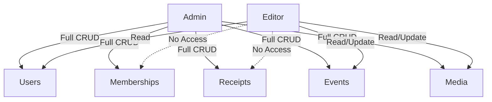

# Admin Portal Specification

## Authentication & Roles (Supabase Auth)
| Role | Description | Permissions |
|------|-------------|-------------|
| **admin** | Full access – can manage members, receipts, events, media, and site settings. | CRUD all resources |
| **editor** | Limited access – can edit content, manage events and media but cannot modify user roles or financial data. | Create/Update events, media; Read members/receipts |

Supabase Auth will be configured with **email‑password** login and **magic link** option.  A `role` column is stored in the `users` table and enforced via Row‑Level Security (RLS) policies.

## Dashboard Layout (Wireframe)
```
+---------------------------------------------------+
| Header: Logo | Nav (Dashboard, Members, Events, | User avatar |
|          | Receipts, Media, Settings)               |
|---------------------------------------------------|
| Sidebar (collapsed on mobile)                     |
|   • Overview (KPIs)                               |
|   • Membership Management                         |
|   • Receipt Management                            |
|   • Event Management                              |
|   • Media Library                                 |
|   • Settings                                      |
|---------------------------------------------------|
| Main Content Area – context‑specific panels      |
|   • Table view with search, filters, pagination   |
|   • Detail drawer / modal for edit forms          |
|---------------------------------------------------|
| Footer – version, support links                   |
++---------------------------------------------------+
```

## Membership Management
* **List & Search** – Table with columns: Member ID, Name, Email, Status, Plan, Expires, Stripe Customer ID.
* **Filters** – Status (active, expired, pending), Plan type, date range.
* **Sync with Stripe** – Button `Sync Stripe` triggers a Vercel Function that pulls latest customer data and updates the `memberships` table.
* **Status Updates** – Admin can manually set membership status (e.g., cancel, renew) which updates Stripe via the Stripe API.

## Receipt Management
* **View Receipts** – Paginated list showing receipt ID, member, amount, date, type (membership/donation), PDF download link.
* **Manual Issue** – Form with fields: Recipient email, amount, description, template selector. Submits to a Vercel Function that generates a PDF (using `pdf-lib` or `puppeteer`) and emails via SendGrid.
* **Template Storage** – HTML/JSX receipt templates stored in Supabase Storage bucket `receipt-templates`. Admin UI provides a simple code editor (e.g., `react-ace`).

## Event Management
* **Create / Edit Event** – Form fields: Title, Description (Markdown), Date & Time, Location, Image(s), **Free** or **Paid** toggle.
* **Paid Events** – When marked paid, admin selects a Stripe Product ID; ticket quantity and pricing tiers are defined.
* **Ticket Management** – Table of tickets sold, attendee list, export CSV.
* **SEO for Event Pages** – Each event page includes `Event` schema.org markup with `startDate`, `location`, `image`, and `offers` (price, availability).

## Role Permissions Matrix


## UI Components (Reusable)
* **DataTable** – `react-table` with server‑side pagination via Supabase RPC.
* **FormBuilder** – `formik` + `yup` validation, supports dynamic fields for event tickets.
* **Modal / Drawer** – `@headlessui/react` for edit forms.
* **Toast Notifications** – `react-hot-toast` for success/error feedback.

---

*Generated on {{date}}*

