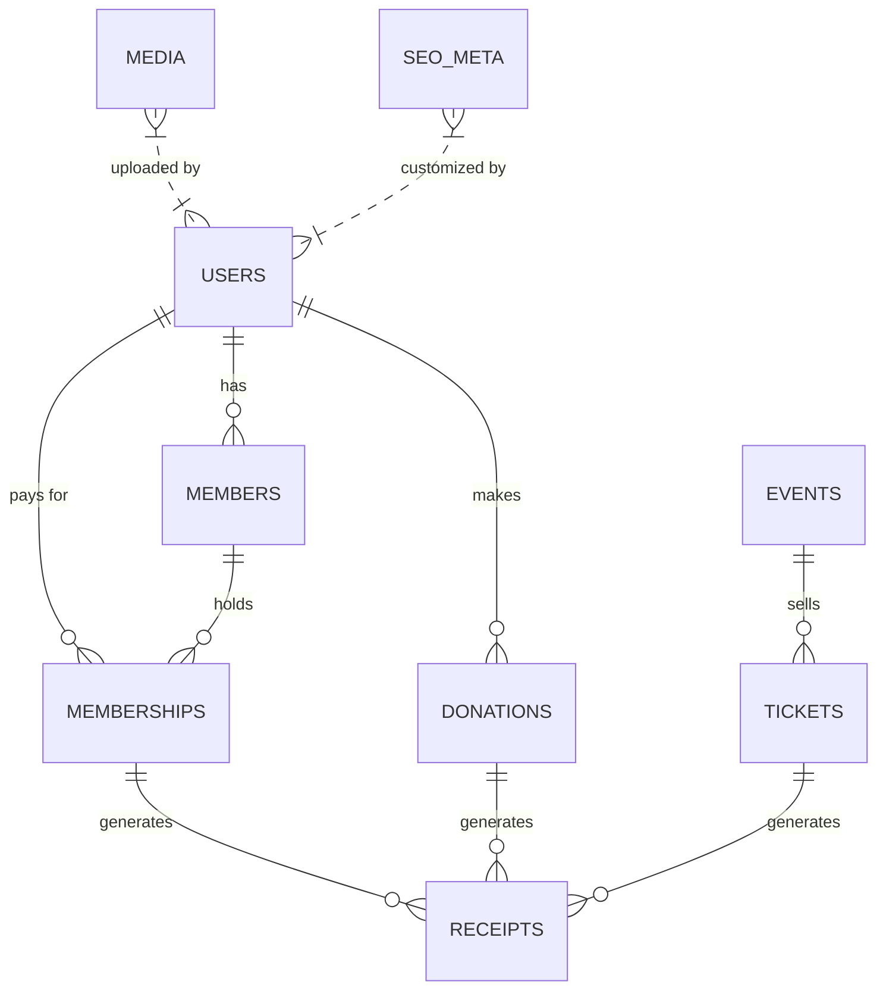

# Database Schema (Supabase)

## Tables Overview
| Table | Description |
|-------|-------------|
| `users` | Supabase Auth users – includes `role` column for RBAC |
| `members` | Profile information for members (name, address, phone) |
| `memberships` | Membership records – links to Stripe customer & product |
| `donations` | One‑time and recurring donation records |
| `events` | Event metadata – title, description, date, location, paid flag |
| `tickets` | Ticket purchases for paid events – links to Stripe payment |
| `receipts` | Generated receipt metadata – PDF URL, email status |
| `media` | Media assets (photos, videos) stored in Supabase Storage |
| `seo_meta` | Custom SEO overrides per page (title, description, OG tags) |

## ER Diagram


## Column Definitions & Indexes
### `users`
| Column | Type | Description |
|--------|------|-------------|
| `id` | `uuid` PK | Supabase Auth UID |
| `email` | `text` | Unique email address |
| `role` | `text` | `admin` or `editor` |
| `created_at` | `timestamp` | Auto‑generated |
* Index on `email` (unique).

### `members`
| Column | Type | Description |
|--------|------|-------------|
| `id` | `uuid` PK | Primary key |
| `user_id` | `uuid` FK → `users.id` |
| `full_name` | `text` |
| `address` | `text` |
| `phone` | `text` |
| `joined_at` | `timestamp` |
* Index on `user_id`.

### `memberships`
| Column | Type | Description |
|--------|------|-------------|
| `id` | `uuid` PK |
| `member_id` | `uuid` FK → `members.id` |
| `stripe_customer_id` | `text` |
| `stripe_subscription_id` | `text` |
| `plan` | `text` | `annual`, `semi_annual`, `monthly` |
| `status` | `text` | `active`, `canceled`, `past_due` |
| `started_at` | `timestamp` |
| `expires_at` | `timestamp` |
* Composite index on (`member_id`, `plan`).

### `donations`
| Column | Type | Description |
|--------|------|-------------|
| `id` | `uuid` PK |
| `user_id` | `uuid` FK → `users.id` |
| `stripe_payment_intent_id` | `text` |
| `amount_eur` | `numeric` |
| `recurring` | `boolean` |
| `created_at` | `timestamp` |
* Index on `user_id`.

### `events`
| Column | Type | Description |
|--------|------|-------------|
| `id` | `uuid` PK |
| `title` | `text` |
| `description` | `text` |
| `start_date` | `timestamp` |
| `end_date` | `timestamp` |
| `location` | `text` |
| `is_paid` | `boolean` |
| `stripe_product_id` | `text` |
| `created_at` | `timestamp` |
* Index on `start_date`.

### `tickets`
| Column | Type | Description |
|--------|------|-------------|
| `id` | `uuid` PK |
| `event_id` | `uuid` FK → `events.id` |
| `user_id` | `uuid` FK → `users.id` |
| `stripe_price_id` | `text` |
| `quantity` | `int` |
| `purchased_at` | `timestamp` |
* Index on `event_id`.

### `receipts`
| Column | Type | Description |
|--------|------|-------------|
| `id` | `uuid` PK |
| `related_id` | `uuid` | ID of membership, donation, or ticket |
| `type` | `text` | `membership`, `donation`, `ticket` |
| `pdf_url` | `text` |
| `sent_at` | `timestamp` |
| `created_at` | `timestamp` |
* Index on (`type`, `related_id`).

### `media`
| Column | Type | Description |
|--------|------|-------------|
| `id` | `uuid` PK |
| `bucket` | `text` | Supabase storage bucket name |
| `path` | `text` | File path within bucket |
| `alt_text` | `text` |
| `uploaded_by` | `uuid` FK → `users.id` |
| `uploaded_at` | `timestamp` |
* Index on `bucket`.

### `seo_meta`
| Column | Type | Description |
|--------|------|-------------|
| `id` | `uuid` PK |
| `page_path` | `text` |
| `title` | `text` |
| `description` | `text` |
| `og_image` | `text` |
| `canonical_url` | `text` |
| `created_at` | `timestamp` |
* Unique index on `page_path`.

## Row‑Level Security (RLS) Policies
* **users** – `role` column determines access. `admin` can `SELECT *`; `editor` can only `SELECT id, email, role`.
* **memberships** – `admin` can `SELECT/INSERT/UPDATE/DELETE`. `editor` can `SELECT` where `member_id` belongs to them.
* **donations** – `admin` full access; `editor` read‑only.
* **events** – `admin` full; `editor` can `SELECT` and `UPDATE` where `is_paid = false`.
* **tickets** – `admin` full; `editor` read‑only.
* **receipts** – `admin` full; `editor` can read their own receipts.
* **media** – `admin` full; `editor` can upload to `public-gallery` bucket only.

## Migration Scripts (SQL)
```sql
-- Enable extensions
create extension if not exists "uuid-ossp";

-- users table (Supabase Auth creates this automatically, we add role column)
alter table auth.users add column role text default 'editor';
create unique index users_email_idx on auth.users(email);

-- members
create table members (
  id uuid primary key default uuid_generate_v4(),
  user_id uuid references auth.users(id) on delete cascade,
  full_name text not null,
  address text,
  phone text,
  joined_at timestamp default now()
);
create index members_user_id_idx on members(user_id);

-- memberships
create table memberships (
  id uuid primary key default uuid_generate_v4(),
  member_id uuid references members(id) on delete cascade,
  stripe_customer_id text,
  stripe_subscription_id text,
  plan text,
  status text,
  started_at timestamp,
  expires_at timestamp
);
create unique index memberships_member_plan_idx on memberships(member_id, plan);

-- donations
create table donations (
  id uuid primary key default uuid_generate_v4(),
  user_id uuid references auth.users(id) on delete cascade,
  stripe_payment_intent_id text,
  amount_eur numeric,
  recurring boolean,
  created_at timestamp default now()
);
create index donations_user_id_idx on donations(user_id);

-- events
create table events (
  id uuid primary key default uuid_generate_v4(),
  title text not null,
  description text,
  start_date timestamp,
  end_date timestamp,
  location text,
  is_paid boolean default false,
  stripe_product_id text,
  created_at timestamp default now()
);
create index events_start_date_idx on events(start_date);

-- tickets
create table tickets (
  id uuid primary key default uuid_generate_v4(),
  event_id uuid references events(id) on delete cascade,
  user_id uuid references auth.users(id) on delete cascade,
  stripe_price_id text,
  quantity int default 1,
  purchased_at timestamp default now()
);
create index tickets_event_id_idx on tickets(event_id);

-- receipts
create table receipts (
  id uuid primary key default uuid_generate_v4(),
  related_id uuid not null,
  type text not null,
  pdf_url text,
  sent_at timestamp,
  created_at timestamp default now()
);
create unique index receipts_type_related_idx on receipts(type, related_id);

-- media
create table media (
  id uuid primary key default uuid_generate_v4(),
  bucket text not null,
  path text not null,
  alt_text text,
  uploaded_by uuid references auth.users(id),
  uploaded_at timestamp default now()
);
create index media_bucket_idx on media(bucket);

-- seo_meta
create table seo_meta (
  id uuid primary key default uuid_generate_v4(),
  page_path text not null unique,
  title text,
  description text,
  og_image text,
  canonical_url text,
  created_at timestamp default now()
);
```

---

*Generated on {{date}}*

