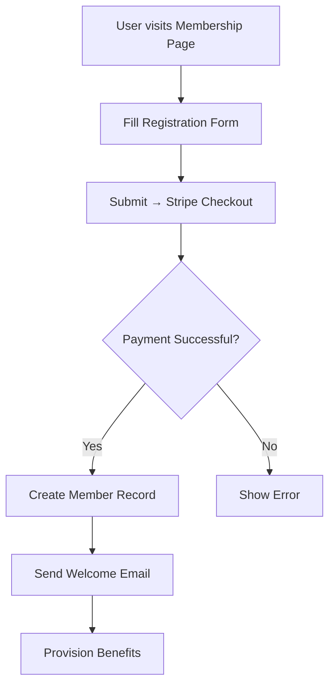
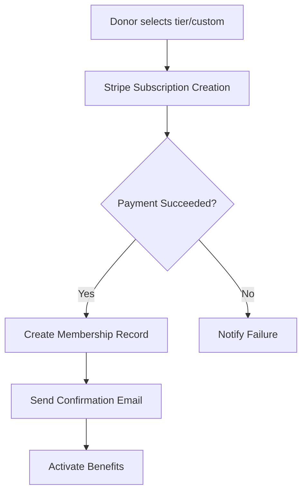
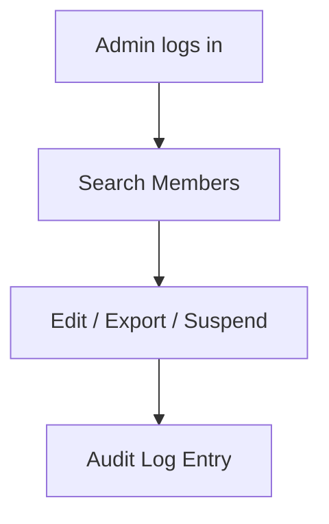

# Hindu Association of Ireland – Membership System Technical Specification

## 1. Functional Requirements (FR)

### 1.1 User Registration
- Capture **First Name**, **Last Name**, **Email** (validated with regex), **Phone** (validated with regex).
- Explicit GDPR consent checkbox linked to the terms of service; consent timestamp recorded.

### 1.2 Annual Membership
- One‑time €20 payment processed via **Stripe Checkout**.
- Automatic receipt generation (PDF/HTML) and storage in supabase.
- Welcome email dispatched with receipt attachment.

#### 1.2.1 Optional Monthly Contribution (Integrated Flow)
*Users may optionally add a recurring monthly donation at the same time they purchase the annual membership.*
* **UI/UX** – A clearly labeled toggle/checkbox **“Add a monthly contribution”** appears on the membership checkout page, positioned below the annual fee selector. When enabled, preset amounts (configurable by admin) and a custom amount field become visible. Tooltips explain that the donation is separate, recurring, and can be cancelled at any time.
* **Validation** – The contribution amount must pass the same currency‑format regex as the annual fee. Frequency is fixed to monthly; currency is configurable (default EUR). The Stripe subscription is created together with the one‑time payment using a **Setup Intent** to attach the recurring payment method.
* **Checkout Transaction** – Both the one‑time annual fee and the optional subscription are processed in a single Stripe Checkout Session. The session includes two line items: the annual membership (price‑id `annual_membership`) and, if selected, the recurring donation (price‑id `monthly_donation_{tier}` or a custom price created on‑the‑fly).
* **Backend Data Model** – A new table `monthly_contribution` links to `membership`:
  ```sql
  CREATE TABLE monthly_contribution (
    id uuid PRIMARY KEY DEFAULT gen_random_uuid(),
    membership_id uuid REFERENCES membership(id) ON DELETE CASCADE,
    stripe_price_id text NOT NULL,
    amount_cents integer NOT NULL,
    currency text NOT NULL,
    start_date date NOT NULL,
    status text NOT NULL CHECK (status IN ('active','canceled')),
    created_at timestamp with time zone DEFAULT now()
  );
  ```
* **Receipt & Email** – The welcome email includes a section summarising the optional donation, its amount, and next billing date. Monthly donation receipts are sent together with the regular monthly receipt.
* **Admin Controls** – Feature flag `enable_monthly_contribution` (boolean) in the admin settings. Admins can set default suggested amounts, currency, and custom help text displayed on the checkout page.

### 1.3 Recurring Monthly Donations

### 1.3 Recurring Monthly Donations
- Three preset tiers:
  - **Shraddha** – €22
  - **Seva** – €35
  - **Bhakti** – €50
  - **Custom** – free‑form amount entered by the donor.
- Payments start the month after sign‑up using **Stripe Subscriptions**.

### 1.4 Benefits Allocation (on successful payment)
1. **Monthly Nama‑Nakshatra Archana** – scheduled each month.
2. **One annual special‑occasion Archana** – scheduled on the member’s anniversary.
3. **Karpaga Vriksham leaf entry** – store member name and thumb‑impression image in GCS; link stored in DB.

### 1.5 Email Automation
- Templated **welcome email** with receipt after annual fee.
- **Monthly donation confirmation** email with receipt.
- **Renewal reminder** 7 days before next recurring charge.
- **Cancellation notice** when a subscription is deleted.

### 1.6 Admin Portal
- Full **CRUD** on member records.
- View & filter **payment history**.
- Download receipts (PDF/HTML).
- Change plan type (annual ↔ monthly), suspend/reactivate accounts.
- Export data to **CSV/Excel**.
- Advanced multi‑field **search** (name, email, phone, plan, status).
- **Role‑based access**:
  - **Super‑Admin** – all permissions.
  - **Finance** – view/payments, export, edit financial status.
  - **Community Manager** – member CRUD, benefit provisioning.

### 1.7 Reporting Dashboard
Real‑time KPIs with trend graphs:
- Total members
- Annual fees collected
- Monthly recurring totals
- Churn rate
- Donation‑tier distribution

### 1.8 Data Privacy & Compliance
- GDPR consent capture and **right‑to‑be‑forgotten** workflow.
- Encryption **at rest** (PostgreSQL Transparent Data Encryption) and **in transit** (TLS 1.3).
- **Audit logging** for all admin actions and data changes.

## 2. User Workflow Diagrams






## 3. Event Triggers & Dataflow
### Stripe Webhook Events
| Event | Action |
|-------|--------|
| `checkout.session.completed` | Verify payment, create member record, send welcome email, enqueue benefit provisioning job |
| `invoice.payment_succeeded` | Update recurring status, send monthly receipt, log transaction |
| `customer.subscription.created` | Set membership status **active**, schedule first benefit |
| `customer.subscription.deleted` | Mark member **inactive**, send cancellation email, stop benefit provisioning |

### Pseudocode for Webhook Handler (NestJS)
```typescript
@Controller('webhooks/stripe')
export class StripeWebhookController {
  @Post()
  @Headers('stripe-signature')
  async handle(@Body() rawBody: Buffer, @Headers('stripe-signature') sig: string) {
    const event = this.stripeService.constructEvent(rawBody, sig);
    switch (event.type) {
      case 'checkout.session.completed':
        await this.membershipService.handleCheckoutCompleted(event.data.object);
        break;
      case 'invoice.payment_succeeded':
        await this.membershipService.handleInvoiceSucceeded(event.data.object);
        break;
      case 'customer.subscription.created':
        await this.membershipService.handleSubscriptionCreated(event.data.object);
        break;
      case 'customer.subscription.deleted':
        await this.membershipService.handleSubscriptionDeleted(event.data.object);
        break;
      default:
        console.log(`Unhandled event type ${event.type}`);
    }
    return { received: true };
  }
}
```

## 4. Architecture Design
### 4.1 Frontend
- **React** with **Next.js** (SSR for SEO).
- **TypeScript** for static typing.
- UI library: **Shadcn UI** (already present in repo).
- **Stripe Elements** for payment UI.
- Form validation with **Yup** + **react‑hook‑form**.
- State management via **Redux Toolkit** (member profile, subscription state).

### 4.2 Backend
- **Node.js** with **NestJS** (REST + GraphQL endpoints).
- **Supabase** (PostgreSQL) for relational data storage.
  - Supabase Auth optional for SSO.
- **Redis** for background job queue (benefit provisioning, email sending).
- **SendGrid** via **Nodemailer** for transactional emails.
  - Email templates stored in `netlify/functions/lib/` (e.g., `rsvpEmailTemplate.ts`).
  - New templates for membership emails will be added similarly.
  - **Google Cloud Storage** for thumb‑impression images.

### 4.3 Integrations
- **Stripe** – Payments & Subscriptions.
- **SendGrid** – Email delivery.
- **Supabase Auth** – Optional SSO.
- **Supabase** – Secure storage of Karpaga leaf images.

### 4.4 Security
- OWASP Top 10 mitigations (input sanitisation, CSP, XSS/CSRF protection).
- Enforce **HTTPS** everywhere (Netlify edge TLS).
- **JWT** access & refresh tokens; short‑lived access tokens (15 min).
- Role‑based API authorisation (NestJS guards).
- PCI‑DSS compliance via Stripe (no card data stored on our servers).
- Regular static analysis (ESLint, SonarQube) and penetration testing.

## 5. Data Model (JSON Schemas)
### 5.1 User
```json
{
  "$schema": "http://json-schema.org/draft-07/schema#",
  "title": "User",
  "type": "object",
  "required": ["id", "first_name", "last_name", "email", "phone", "consent_timestamp", "created_at", "updated_at"],
  "properties": {
    "id": { "type": "string", "format": "uuid" },
    "first_name": { "type": "string", "maxLength": 50 },
    "last_name": { "type": "string", "maxLength": 50 },
    "email": { "type": "string", "format": "email" },
    "phone": { "type": "string", "pattern": "^\\+?[0-9]{7,15}$" },
    "consent_timestamp": { "type": "string", "format": "date-time" },
    "created_at": { "type": "string", "format": "date-time" },
    "updated_at": { "type": "string", "format": "date-time" }
  }
}
```
### 5.2 Membership
```json
{
  "$schema": "http://json-schema.org/draft-07/schema#",
  "title": "Membership",
  "type": "object",
  "required": ["id", "user_id", "type", "status", "start_date", "stripe_customer_id"],
  "properties": {
    "id": { "type": "string", "format": "uuid" },
    "user_id": { "type": "string", "format": "uuid" },
    "type": { "type": "string", "enum": ["annual", "monthly"] },
    "status": { "type": "string", "enum": ["active", "inactive", "canceled"] },
    "start_date": { "type": "string", "format": "date" },
    "end_date": { "type": ["string", "null"], "format": "date" },
    "stripe_customer_id": { "type": "string" },
    "stripe_subscription_id": { "type": ["string", "null"] }
  }
}
```
### 5.3 Payment
```json
{
  "$schema": "http://json-schema.org/draft-07/schema#",
  "title": "Payment",
  "type": "object",
  "required": ["id", "membership_id", "stripe_payment_intent_id", "amount_cents", "currency", "status", "receipt_url", "created_at"],
  "properties": {
    "id": { "type": "string", "format": "uuid" },
    "membership_id": { "type": "string", "format": "uuid" },
    "stripe_payment_intent_id": { "type": "string" },
    "amount_cents": { "type": "integer" },
    "currency": { "type": "string", "enum": ["EUR"] },
    "status": { "type": "string", "enum": ["succeeded", "failed", "pending"] },
    "receipt_url": { "type": "string", "format": "uri" },
    "created_at": { "type": "string", "format": "date-time" }
  }
}
```
### 5.4 Benefit
```json
{
  "$schema": "http://json-schema.org/draft-07/schema#",
  "title": "Benefit",
  "type": "object",
  "required": ["id", "membership_id", "nama_nakshatra_date", "special_archana_date", "karpaga_leaf_id"],
  "properties": {
    "id": { "type": "string", "format": "uuid" },
    "membership_id": { "type": "string", "format": "uuid" },
    "nama_nakshatra_date": { "type": "string", "format": "date" },
    "special_archana_date": { "type": "string", "format": "date" },
    "karpaga_leaf_id": { "type": "string", "format": "uuid" }
  }
}
```
### 5.5 KarpagaLeaf
```json
{
  "$schema": "http://json-schema.org/draft-07/schema#",
  "title": "KarpagaLeaf",
  "type": "object",
  "required": ["id", "member_name", "thumb_image_url", "created_at"],
  "properties": {
    "id": { "type": "string", "format": "uuid" },
    "member_name": { "type": "string" },
    "thumb_image_url": { "type": "string", "format": "uri" },
    "created_at": { "type": "string", "format": "date-time" }
  }
}
```
### 5.6 AdminLog
```json
{
  "$schema": "http://json-schema.org/draft-07/schema#",
  "title": "AdminLog",
  "type": "object",
  "required": ["id", "admin_user_id", "action", "target_id", "timestamp"],
  "properties": {
    "id": { "type": "string", "format": "uuid" },
    "admin_user_id": { "type": "string", "format": "uuid" },
    "action": { "type": "string" },
    "target_id": { "type": "string" },
    "timestamp": { "type": "string", "format": "date-time" }
  }
}
```

## 6. Compliance & Standards
- **Branding**: Follow HAI branding guide (colors, logo usage – see `Plan/LOGO_AND_FIXES.md`).
- **Accessibility**: WCAG 2.1 AA compliance (ARIA labels, colour contrast, keyboard navigation).
- **GDPR**: Consent capture, data‑subject access request (DSAR) workflow, right‑to‑be‑forgotten (hard delete).
- **PCI‑DSS**: No card data stored; all payment handling delegated to Stripe.
- **ISO 27001** basics – encrypted storage, least‑privilege IAM, regular backups.
- **Code Quality**: ESLint (Airbnb), Prettier, TypeScript strict mode, unit test coverage ≥ 80 % (Jest + React Testing Library), integration tests for payment flow (Cypress).
- **Documentation**: OpenAPI/Swagger for all API endpoints (`Plan/API_ENDPOINTS.md`). Developer README, runbooks for incident response, data‑retention policy.

## 7. Deliverables
1. **Structured markdown** – this document (`Plan/MEMBERSHIP_SYSTEM_SPECIFICATION.md`).
2. **Sample JSON schemas** – included in Section 5.
3. **Pseudocode** for Stripe webhook handling – Section 3.
4. **High‑level sequence diagram** (Mermaid) – Section 2.
5. **Exportable CSV/Excel schema** for admin reports:
   - Columns: `Member ID`, `First Name`, `Last Name`, `Email`, `Phone`, `Plan Type`, `Status`, `Start Date`, `Next Billing Date`, `Total Paid (€)`, `Last Payment Date`.

---

*Prepared for the launch of the permanent Hindu Temple and Cultural Centre in Limerick.*
